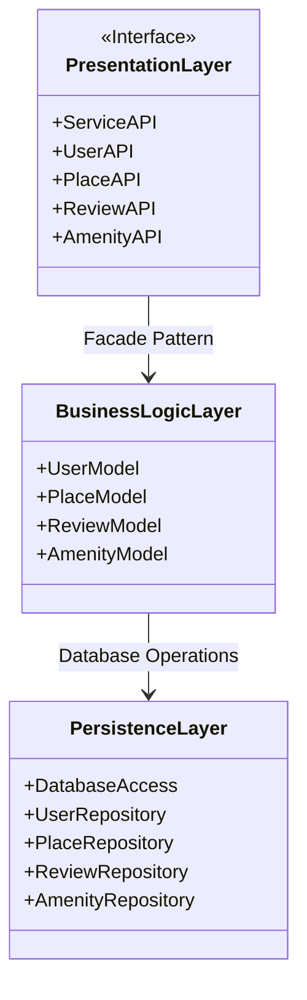

# High-Level Package Diagram

## Package Diagram

## Explanatory Notes

### Presentation Layer (Services, API)
This layer acts as the front door of the application. It is the only layer that directly communicates with the outside world. It receives HTTP requests from the client, routes them to the appropriate function, and returns responses in JSON format. It contains the following components:
- **UserAPI**: Handles user registration, profile updates, and deletion.
- **PlaceAPI**: Handles place creation, updates, deletion, and listing.
- **ReviewAPI**: Handles review creation, updates, deletion, and listing by place.
- **AmenityAPI**: Handles amenity creation, updates, deletion, and listing.

This layer does not contain any business logic. It receives requests and forwards them to the Business Logic Layer through the Facade Pattern.

### Business Logic Layer (Models)
This layer is the brain of the application. It contains the core business logic, enforces business rules, and represents the entities of the system. All models inherit common attributes: a unique **id**, **created_at**, and **updated_at** timestamps for audit purposes. The key models are:
- **User**: first_name, last_name, email, password, is_admin (boolean).
- **Place**: title, description, price, latitude, longitude, owner (User), amenities (list of Amenity).
- **Review**: rating, comment, place (Place), user (User).
- **Amenity**: name, description.

This layer validates data, applies business rules, and coordinates between the Presentation and Persistence layers.

### Persistence Layer
This layer acts as the memory of the application. It is responsible for storing data permanently and retrieving it when requested. It provides repository classes that abstract the database operations:
- **UserRepository**: CRUD operations for users.
- **PlaceRepository**: CRUD operations for places.
- **ReviewRepository**: CRUD operations for reviews.
- **AmenityRepository**: CRUD operations for amenities.
- **DatabaseAccess**: Manages the connection to the database.

The Business Logic layer does not know how the data is saved. It trusts this layer to handle storage, whether using file storage or a relational database.

### How the Facade Pattern Facilitates Communication
The Facade Pattern provides a unified and simplified interface between the Presentation Layer and the Business Logic Layer. Instead of the API endpoints calling and managing internal models directly, they communicate exclusively with the Facade. The Facade handles and organizes these calls in the background.

This approach provides the following benefits:
- **Reducing Complexity**: The API layer does not need to know how data is processed or validated internally.
- **Layer Isolation**: Each layer is completely encapsulated and unaffected by changes in other layers.
- **Facilitating Maintenance**: Modifications to business logic or data handling only require changes inside the Facade or backend layer, without touching the API layer.

The communication flow works as follows:
1. The user sends a request (e.g., registering a new user or creating a place).
2. The **Presentation Layer** (API) receives the request and forwards it to the **Facade**.
3. The **Facade** routes the request to the appropriate classes inside the **Business Logic Layer**.
4. The **Business Logic Layer** processes the data and verifies business rules.
5. The **Persistence Layer** saves or retrieves the data from the database.
6. The response travels back through the reverse path: Persistence → Business Logic → Facade → Presentation → User.