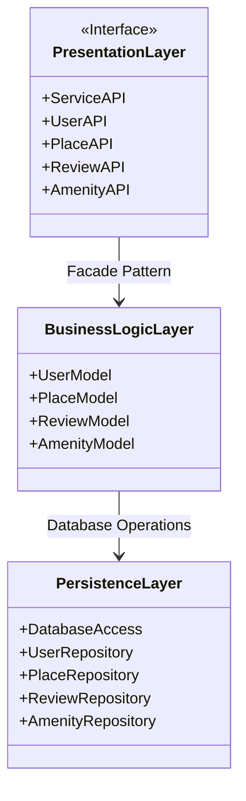
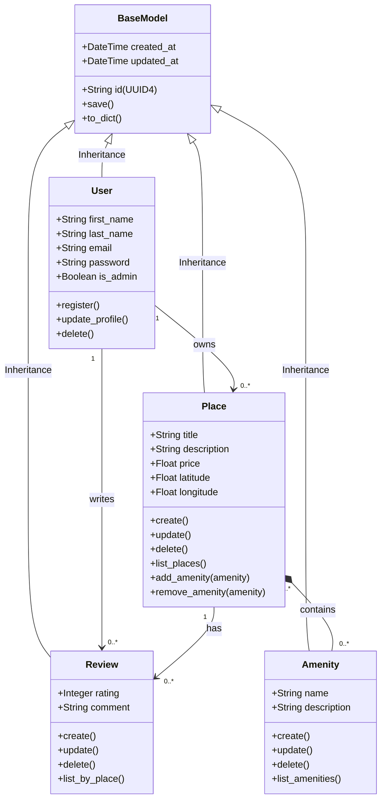
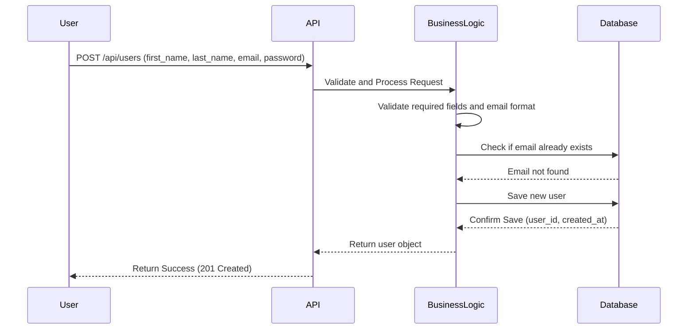
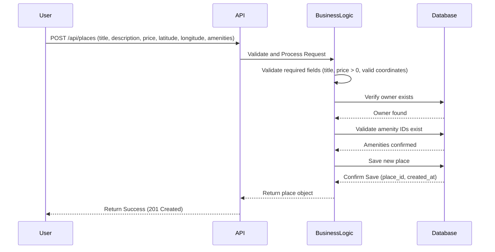
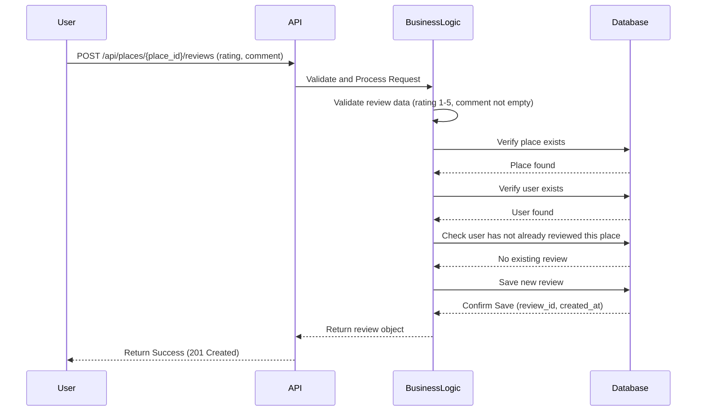
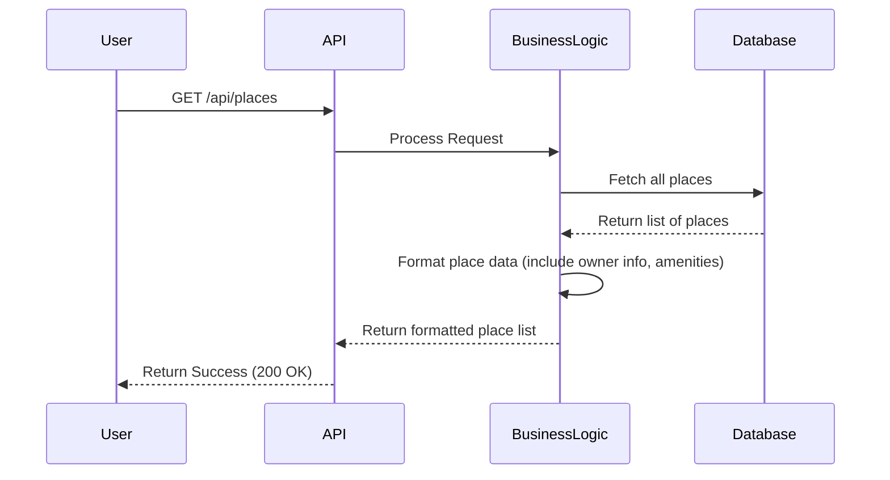

# HBnB Evolution - Technical Documentation

## Table of Contents
1. [Introduction](#introduction)
2. [High-Level Architecture](#high-level-architecture)
3. [Business Logic Layer](#business-logic-layer)
4. [API Interaction Flow](#api-interaction-flow)

---

## Introduction

This document provides comprehensive technical documentation for the HBnB Evolution application, a simplified version of an AirBnB-like platform. The application allows users to register, list properties, leave reviews, and manage amenities.

The purpose of this document is to serve as a detailed blueprint for the implementation phases of the project. It contains the system architecture, the design of the business logic, and the interaction flows between the different layers of the application.

The document is organized into three main sections:
- **High-Level Architecture**: A package diagram showing the three-layer architecture and the communication between layers via the Facade Pattern.
- **Business Logic Layer**: A class diagram showing the entities, their attributes, methods, and relationships.
- **API Interaction Flow**: Sequence diagrams showing the step-by-step process of handling four key API requests.

---

## High-Level Architecture

### Package Diagram

### Presentation Layer (Services, API)
This layer acts as the front door of the application. It is the only layer that directly communicates with the outside world. It receives HTTP requests from the client, routes them to the appropriate function, and returns responses in JSON format. It contains the following components:
- **UserAPI**: Handles user registration, profile updates, and deletion.
- **PlaceAPI**: Handles place creation, updates, deletion, and listing.
- **ReviewAPI**: Handles review creation, updates, deletion, and listing by place.
- **AmenityAPI**: Handles amenity creation, updates, deletion, and listing.

This layer does not contain any business logic. It receives requests and forwards them to the Business Logic Layer through the Facade Pattern.

### Business Logic Layer (Models)
This layer is the brain of the application. It contains the core business logic, enforces business rules, and represents the entities of the system. All models inherit common attributes: a unique **id**, **created_at**, and **updated_at** timestamps for audit purposes. The key models are:
- **User**: first_name, last_name, email, password, is_admin (boolean).
- **Place**: title, description, price, latitude, longitude, owner (User), amenities (list of Amenity).
- **Review**: rating, comment, place (Place), user (User).
- **Amenity**: name, description.

This layer validates data, applies business rules, and coordinates between the Presentation and Persistence layers.

### Persistence Layer
This layer acts as the memory of the application. It is responsible for storing data permanently and retrieving it when requested. It provides repository classes that abstract the database operations:
- **UserRepository**: CRUD operations for users.
- **PlaceRepository**: CRUD operations for places.
- **ReviewRepository**: CRUD operations for reviews.
- **AmenityRepository**: CRUD operations for amenities.
- **DatabaseAccess**: Manages the connection to the database.

The Business Logic layer does not know how the data is saved. It trusts this layer to handle storage, whether using file storage or a relational database.

### Facade Pattern
The Facade Pattern provides a unified and simplified interface between the Presentation Layer and the Business Logic Layer. Instead of the API endpoints calling and managing internal models directly, they communicate exclusively with the Facade. The Facade handles and organizes these calls in the background.

This approach provides the following benefits:
- **Reducing Complexity**: The API layer does not need to know how data is processed or validated internally.
- **Layer Isolation**: Each layer is completely encapsulated and unaffected by changes in other layers.
- **Facilitating Maintenance**: Modifications to business logic or data handling only require changes inside the Facade or backend layer, without touching the API layer.

The communication flow works as follows:
1. The user sends a request (e.g., registering a new user or creating a place).
2. The **Presentation Layer** (API) receives the request and forwards it to the **Facade**.
3. The **Facade** routes the request to the appropriate classes inside the **Business Logic Layer**.
4. The **Business Logic Layer** processes the data and verifies business rules.
5. The **Persistence Layer** saves or retrieves the data from the database.
6. The response travels back through the reverse path: Persistence → Business Logic → Facade → Presentation → User.

---

## Business Logic Layer

### Class Diagram

### Entity Descriptions

**BaseModel**
BaseModel is the parent class that all entities inherit from. It provides the common attributes and methods shared across all entities in the system.
- **id (UUID4)**: A universally unique identifier assigned to each object.
- **created_at**: A datetime attribute that records when the object was created.
- **updated_at**: A datetime attribute that records the last time the object was modified.
- **save()**: Saves the current state of the object and updates the updated_at timestamp.
- **to_dict()**: Returns a dictionary representation of the object for serialization.

**User**
The User entity represents a person using the application. Users can register, update their profiles, and be deleted. They can also be identified as administrators.
- **first_name**: The user's first name.
- **last_name**: The user's last name.
- **email**: The user's email address.
- **password**: The user's password.
- **is_admin**: A boolean attribute that identifies whether the user is an administrator.

**Place**
The Place entity represents a property listed by a user. Each place is associated with the user who created it (owner) and can have a list of amenities.
- **title**: The title of the property listing.
- **description**: A text description of the place.
- **price**: The price of the place.
- **latitude**: The geographical latitude coordinate.
- **longitude**: The geographical longitude coordinate.

**Review**
The Review entity represents a user's feedback on a specific place. Each review is associated with one place and one user.
- **rating**: A numerical rating given by the user.
- **comment**: A text comment left by the user.

**Amenity**
The Amenity entity represents a feature or service that can be associated with places (e.g., WiFi, Pool, Parking).
- **name**: The name of the amenity.
- **description**: A text description of the amenity.

### Relationships

| Relationship | Type | Description |
|---|---|---|
| User → Place | One to Many | A user can own multiple places, but each place belongs to one owner. |
| User → Review | One to Many | A user can write multiple reviews, but each review is written by one user. |
| Place → Review | One to Many | A place can have multiple reviews, but each review belongs to one place. |
| Place ↔ Amenity | Many to Many | A place can have multiple amenities, and an amenity can be associated with multiple places. |

---

## API Interaction Flow

### 1. User Registration

**Description**: The user sends a POST request with registration data. The API forwards it to the Business Logic layer, which validates the data and checks for duplicate emails in the Database. If the email is available, the new user is saved and a success response is returned.

### 2. Place Creation

**Description**: The user sends a POST request with place details. The Business Logic layer validates the data, verifies the owner exists, and confirms the amenity IDs are valid. Once all checks pass, the place is saved and a success response is returned.

### 3. Review Submission

**Description**: The user sends a POST request with a rating and comment for a specific place. The Business Logic layer validates the data, verifies both the place and user exist, and checks for duplicate reviews. If all checks pass, the review is saved and a success response is returned.

### 4. Fetching a List of Places

**Description**: The user sends a GET request to retrieve all places. The Business Logic layer fetches the data from the Database, formats it to include owner information and associated amenities, and returns the complete list to the user.

