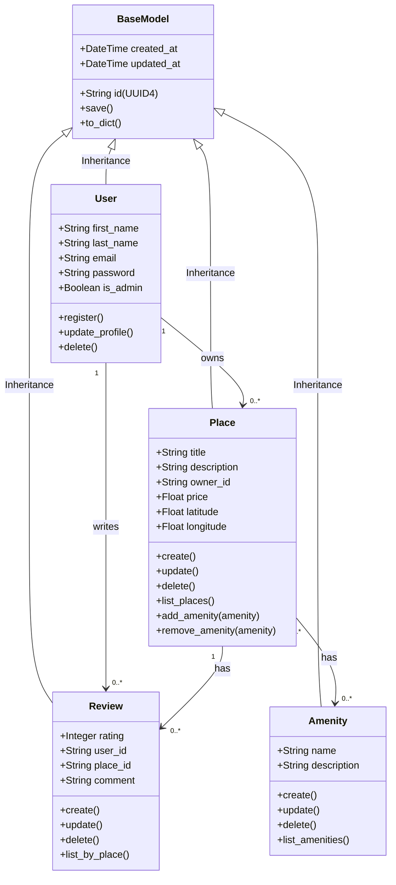

# Detailed Class Diagram for Business Logic Layer

## Class Diagram

## Explanatory Notes

### BaseModel
BaseModel is the parent class that all entities inherit from. It provides the common attributes and methods shared across all entities in the system.
- **id (UUID4)**: A universally unique identifier assigned to each object to ensure every entity is uniquely identifiable.
- **created_at**: A datetime attribute that records when the object was created, used for audit purposes.
- **updated_at**: A datetime attribute that records the last time the object was modified, used for audit purposes.
- **save()**: Saves the current state of the object and updates the `updated_at` timestamp.
- **to_dict()**: Returns a dictionary representation of the object for serialization.

### User
The User entity represents a person using the application. Users can register, update their profiles, and be deleted. They can also be identified as administrators.
- **first_name**: The user's first name.
- **last_name**: The user's last name.
- **email**: The user's email address, used for identification.
- **password**: The user's password for authentication.
- **is_admin**: A boolean attribute that identifies whether the user is an administrator.
- **register()**: Creates a new user account.
- **update_profile()**: Updates the user's profile information.
- **delete()**: Removes the user from the system.

### Place
The Place entity represents a property listed by a user. Each place is associated with the user who created it (owner) and can have a list of amenities.
- **title**: The title of the property listing.
- **description**: A text description of the place.
- **price**: The price of the place.
- **latitude**: The geographical latitude coordinate of the place.
- **longitude**: The geographical longitude coordinate of the place.
- **create()**: Creates a new place listing.
- **update()**: Updates the place information.
- **delete()**: Removes the place from the system.
- **list_places()**: Returns a list of all places.
- **add_amenity(amenity)**: Associates an amenity with the place.
- **remove_amenity(amenity)**: Removes an amenity from the place.

### Review
The Review entity represents a user's feedback on a specific place. Each review is associated with one place and one user.
- **rating**: A numerical rating given by the user.
- **comment**: A text comment left by the user.
- **create()**: Creates a new review.
- **update()**: Updates the review.
- **delete()**: Removes the review from the system.
- **list_by_place()**: Returns all reviews for a specific place.

### Amenity
The Amenity entity represents a feature or service that can be associated with places (e.g., WiFi, Pool, Parking).
- **name**: The name of the amenity.
- **description**: A text description of the amenity.
- **create()**: Creates a new amenity.
- **update()**: Updates the amenity information.
- **delete()**: Removes the amenity from the system.
- **list_amenities()**: Returns a list of all amenities.

### Relationships

**User → Place (One to Many)**
A user can own multiple places, but each place belongs to one owner. This is represented as a `1 to 0..*` association. When a user is deleted, their places should be handled accordingly.

**User → Review (One to Many)**
A user can write multiple reviews, but each review is written by one user. This is represented as a `1 to 0..*` association.

**Place → Review (One to Many)**
A place can have multiple reviews, but each review belongs to one place. This is represented as a `1 to 0..*` association.

**Place ↔ Amenity (Many to Many)**
A place can have multiple amenities, and an amenity can be associated with multiple places. This is represented as a `0..* to 0..*` Many-to-Many Association§. This relationship allow amenities to be reused across different places.

