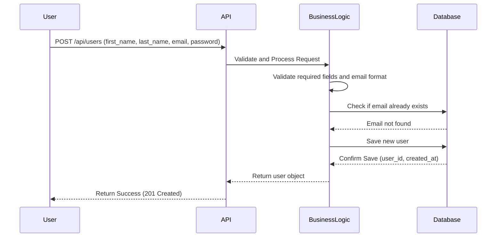
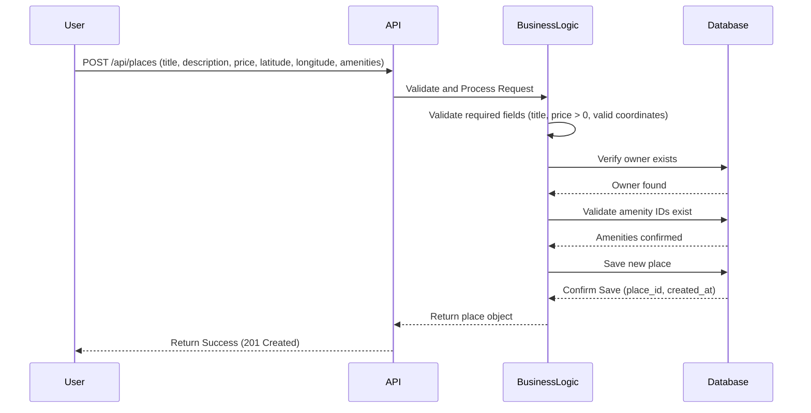
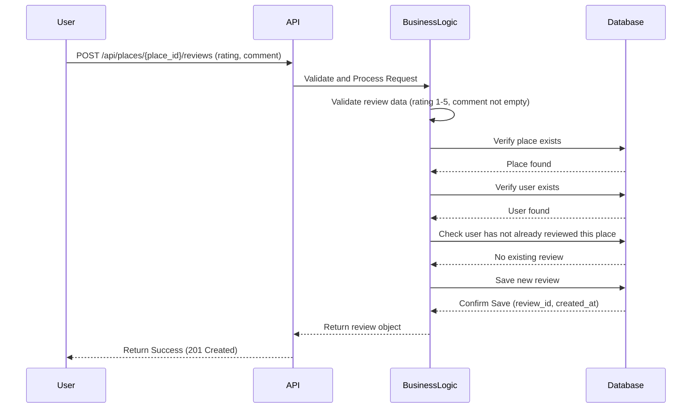
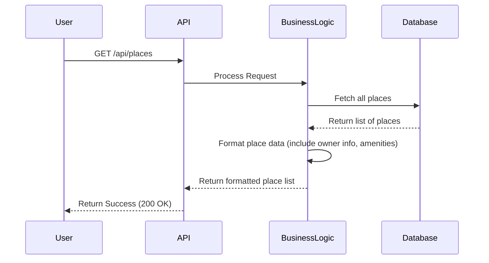

# Sequence Diagrams for API Calls

## 1. User Registration

### Description
This diagram illustrates the process of a new user registering for an account. The user sends a POST request with their registration data. The API layer receives the request and forwards it to the Business Logic layer. The Business Logic layer validates the data (checks required fields and email format), then asks the Database to verify the email is not already in use. If the email is available, the new user data is saved to the Database. The response travels back through the layers, returning a success confirmation with the new user's details.

---

## 2. Place Creation

### Description
This diagram shows how a user creates a new place listing. The user sends a POST request with the place details. The API layer forwards the request to the Business Logic layer, which validates the data (required fields, positive price, valid coordinates). The Business Logic layer then verifies that the owner exists in the Database and that the provided amenity IDs are valid. Once all validations pass, the new place is saved to the Database. The response is returned through the layers with the created place details.

---

## 3. Review Submission

### Description
This diagram depicts the process of a user submitting a review for a place. The user sends a POST request with a rating and comment. The API layer forwards the request to the Business Logic layer, which validates the review data (rating must be between 1-5, comment must not be empty). The Business Logic layer then verifies that both the place and the user exist in the Database, and checks that the user has not already reviewed this place. If all checks pass, the review is saved to the Database. The response is returned with the review details.

---

## 4. Fetching a List of Places

### Description
This diagram shows the process of fetching a list of all available places. The user sends a GET request to retrieve places. The API layer forwards the request to the Business Logic layer, which requests all places from the Database. The Database returns the list of places. The Business Logic layer then formats the data, including the owner information and associated amenities for each place. The formatted list is returned through the layers to the user.
