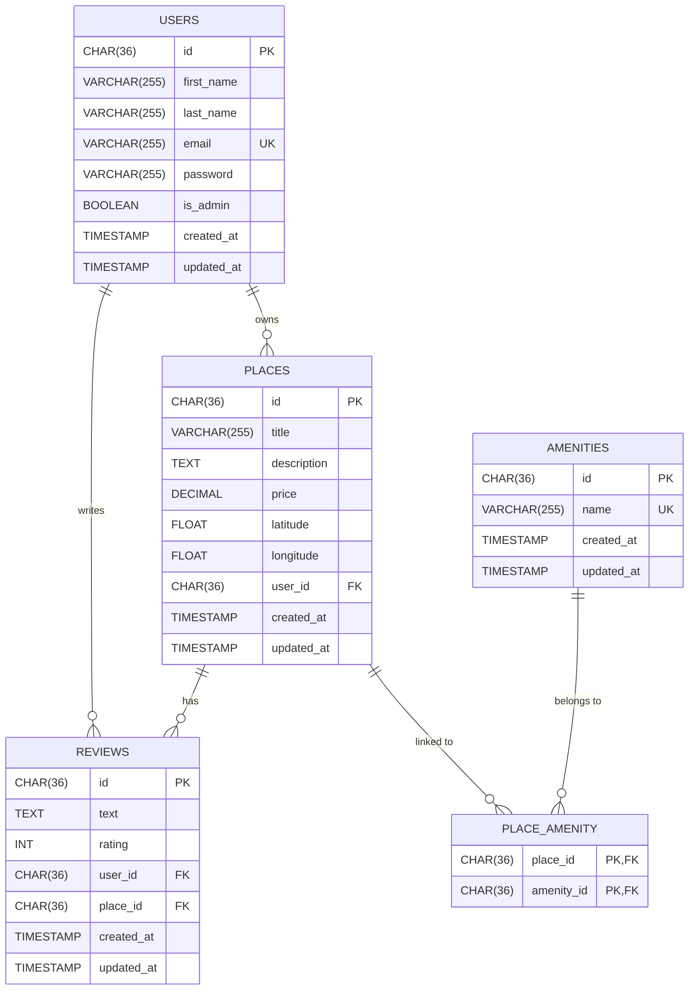

# HBnB Database ER Diagram

This document contains the Entity-Relationship diagram for the HBnB database schema.

## Diagram

## Entity Descriptions

### USERS
Stores application user accounts.
- `id` — Primary key (UUID, 36 characters)
- `email` — Unique identifier used for login
- `password` — Stored as bcrypt hash
- `is_admin` — Boolean flag for administrator privileges

### PLACES
Property listings created by users.
- `user_id` — Foreign key linking to the owner in USERS
- `price` — DECIMAL(10, 2) for currency accuracy

### REVIEWS
User feedback on places.
- `user_id` — Foreign key to the reviewer
- `place_id` — Foreign key to the reviewed place
- `rating` — Integer between 1 and 5 (CHECK constraint)
- Composite unique constraint on (user_id, place_id): a user can only review each place once

### AMENITIES
Available features (WiFi, Pool, etc.).
- `name` — Unique across all amenities

### PLACE_AMENITY
Junction table implementing the many-to-many relationship between places and amenities.
- Composite primary key: (place_id, amenity_id)
- Both columns are also foreign keys

## Relationships

| Relationship | Type | Description |
|---|---|---|
| USERS → PLACES | One-to-Many | One user can own many places |
| USERS → REVIEWS | One-to-Many | One user can write many reviews |
| PLACES → REVIEWS | One-to-Many | One place can have many reviews |
| PLACES ↔ AMENITIES | Many-to-Many | Implemented via PLACE_AMENITY junction table |

## Legend

- **PK** — Primary Key
- **FK** — Foreign Key
- **UK** — Unique Key
